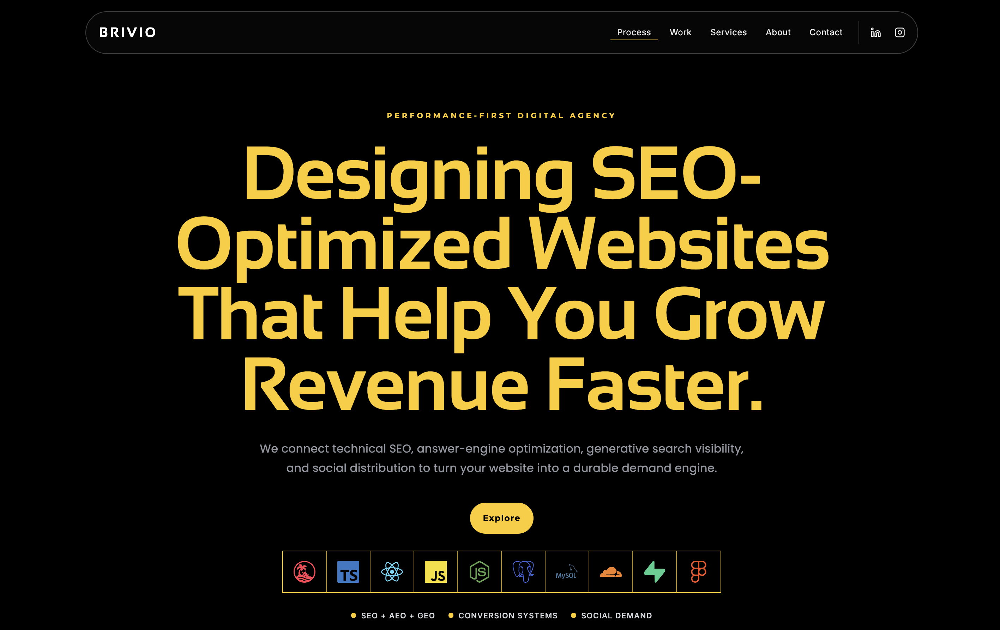
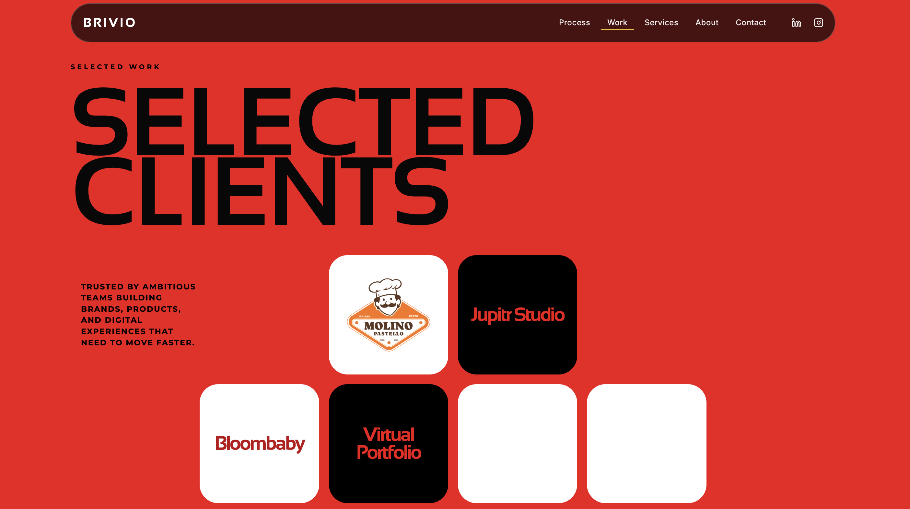

<div align="center">

# BRIVIO

### Build search visibility that turns into qualified demand.

**Performance-first digital agency · SEO · AEO · GEO · Conversion · Web experiences**

[Live website](https://brivio.tech) · [Start a conversation](mailto:hello@brivio.tech)

</div>

---

<p align="center">
  
</p>

## Why BRIVIO exists

Digital growth is often fragmented: a beautiful site that does not convert, search traffic that does not become demand, or content that is invisible to the systems shaping how people discover brands.

BRIVIO was created to bring those disciplines together. We build a connected growth system where strategy, technical SEO, answer-engine optimization, generative search visibility, design, development, and distribution reinforce one another. The aim is not activity for its own sake. It is durable, measurable demand.

## Our point of view

We believe performance is felt before it is measured. A fast, clear, trustworthy experience creates confidence before a metric is ever recorded. Every decision should make it easier for the right audience to find a brand, understand its value, and take the next step.

## Brand values

| Value                     | What it means in practice                                                               |
| ------------------------- | --------------------------------------------------------------------------------------- |
| **Performance first**     | We prioritize work that moves visibility, conversion, and commercial outcomes.          |
| **Data-driven clarity**   | We use evidence to decide what matters, then turn it into focused action.               |
| **Radical trust**         | We communicate clearly, set honest expectations, and make the work visible.             |
| **Craft with purpose**    | Every pixel, interaction, and line of code earns its place.                             |
| **One integrated system** | Strategy, design, engineering, and distribution work together—not as separate handoffs. |

## What we help ambitious teams build

- **Search intelligence** — technical SEO, search-demand architecture, AEO, and GEO.
- **Revenue experiences** — conversion-focused UX/UI, persuasive messaging, and fast websites.
- **Growth infrastructure** — scalable development, resilient deployments, and measurable systems.
- **Distribution loops** — social content and authority-building that compound visibility.

## The BRIVIO process

1. **Strategy** — identify the search demand, customer questions, and conversion opportunities.
2. **Design** — create an experience that makes the value clear and the next step obvious.
3. **Code** — build a fast, accessible, resilient digital product.
4. **Deploy** — launch with dependable infrastructure and a clean measurement foundation.
5. **SEO** — compound authority across search, AI answers, and generative discovery.

## Website preview

<p align="center">
  
</p>
<p align="center">
  
</p>

## Built with

- [TanStack Start](https://tanstack.com/start)
- React and TypeScript
- TanStack Router
- GSAP
- Resend for server-side contact-form delivery
- Vercel-ready deployment configuration

## Run locally

```bash
npm install
npm run dev
```

Create a `.env.local` file for contact-form delivery:

```env
RESEND_API_KEY=re_your_resend_key
RESEND_EMAIL_FROM=onboarding@resend.dev
CONTACT_EMAIL_TO=your-resend-account-email@example.com
```

`onboarding@resend.dev` is for Resend testing and can only send to the account email. After verifying a domain in Resend, use a branded sender such as `BRIVIO <hello@yourdomain.com>`.

## Quality checks

```bash
npm run check
npm run build
```

## Deploy on Vercel

1. Push this repository to GitHub.
2. Import it into [Vercel](https://vercel.com/new).
3. Add the three environment variables above under **Project Settings → Environment Variables**.
4. Deploy, then redeploy whenever environment variables change.

Keep `RESEND_API_KEY` private. Never add the `VITE_` prefix or commit it to the repository.

## Connect with BRIVIO

<!-- Replace the placeholder URLs with your real contact links. -->

- Website: [brivio.tech](https://brivio.tech)
- Email: [hello@brivio.tech](mailto:hello@brivio.tech)
- LinkedIn: [Add your LinkedIn URL](https://linkedin.com/in/your-profile)
- Instagram: [Add your Instagram URL](https://instagram.com/your-profile)
- X / Twitter: [Add your X URL](https://x.com/your-profile)
- Calendly: [Add your booking link](https://calendly.com/your-profile)

---

<div align="center">

**BRIVIO — visibility, experience, and demand working as one system.**

</div>
